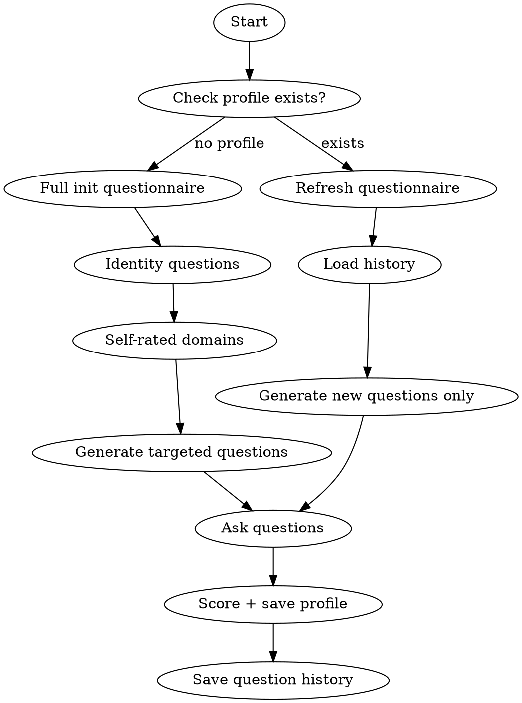

# Knowledge Base - Self Assessment

## Overview

Guide the user through a knowledge self-assessment questionnaire to build or refresh their knowledge profile. Saves questions to avoid repetition across sessions.

## Workflow



## Phase 1: Identity (First time only)

Ask these baseline questions:

1. **身份**: "你的职业/角色是什么？（如：后端开发、数据科学家、全栈工程师、学生等）"
2. **经验**: "你的编程经验有多少年？主要使用什么语言？"
3. **当前工作**: "你目前主要在做什么类型的项目？"
4. **学习目标**: "你希望在哪些方向提升？"

Save responses to profile.md header section.

## Phase 2: Self-Rated Domains

Present domain categories and ask user to self-rate (1-5 stars):

```
请对以下领域给出你的自评（1-5，1=完全不了解，5=精通）：

语言与框架:
- Python: ___
- JavaScript/TypeScript: ___
- Go/Rust/其他: ___

后端:
- Web框架 (FastAPI/Django/Express): ___
- 数据库 (SQL/NoSQL): ___
- API设计: ___

前端:
- React/Vue: ___
- CSS/样式: ___

DevOps:
- Docker/K8s: ___
- CI/CD: ___
- 云服务: ___

计算机科学:
- 算法与数据结构: ___
- 设计模式: ___
- 分布式系统: ___
- 网络协议: ___

你也可以补充上面没有列出的领域。
```

## Phase 3: Targeted Questions

Based on self-rated domains, generate verification questions for:
- Domains rated 2-4 (边界区域, most valuable to assess precisely)
- Adjacent knowledge to their expertise (related domains they might or might not know)

Question format:
```
关于 {domain} 的几个问题（回答"了解/听过/不了解"即可）：
1. {concept from that domain}
2. {slightly advanced concept}
3. {adjacent concept}
```

Generate 3-5 questions per domain rated 2-4. Skip domains rated 1 (clearly unknown) or 5 (clearly known).

## Question History

Save all asked questions to `~/.claude/knowledge/assess-history.json`:

```json
{
  "last_assessed": "2026-05-19",
  "sessions": [
    {
      "date": "2026-05-19",
      "questions": [
        {"domain": "python", "question": "decorators的实现原理", "answer": "了解"},
        {"domain": "distributed", "question": "CAP定理", "answer": "听过"}
      ]
    }
  ],
  "asked_questions": ["decorators的实现原理", "CAP定理"]
}
```

On refresh: load `asked_questions` list, generate NEW questions that haven't been asked before.

## Profile Generation

After assessment, update `~/.claude/knowledge/profile.md`:

```markdown
# 用户知识画像

## 基本信息
- 角色: {from Phase 1}
- 经验: {from Phase 1}
- 主要语言: {from Phase 1}
- 当前方向: {from Phase 1}

## 熟练领域
- {domain} ★★★★★
- ...

## 了解但不深入
- {domain} ★★★
- ...

## 初步接触
- {domain} ★★
- ...

## 待学习（已记录条目）
- ...

## 学习偏好
- {inferred from responses}

## 最近评估: {date}
```

## Refresh Mode

When profile already exists:
1. Show current profile summary
2. Ask: "哪些领域有变化？或者全部重新评估？"
3. If partial: only re-assess specified domains with new questions
4. If full: run complete Phase 2 + 3 with new questions (skip already-asked)
5. Update profile.md with new ratings
