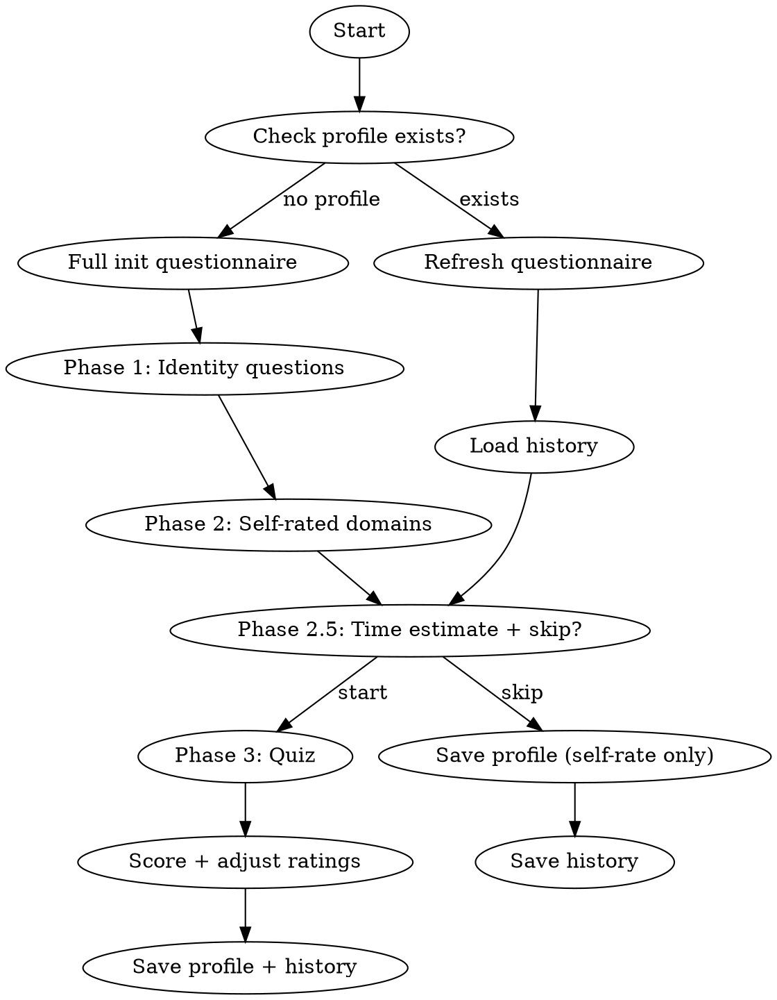

# Knowledge Base - Self Assessment

## Overview

Guide the user through a knowledge self-assessment questionnaire to build or refresh their knowledge profile. Uses objective quiz questions (multiple choice, true/false, fill-in-the-blank) to verify self-rated skill levels. Saves questions to avoid repetition across sessions.

## Workflow



## Phase 1: Identity (First time only)

Use AskUserQuestion to ask these baseline questions interactively:

1. **身份**: "你的职业/角色是什么？（如：后端开发、数据科学家、全栈工程师、学生等）"
2. **经验**: "你的编程经验有多少年？主要使用什么语言？"
3. **当前工作**: "你目前主要在做什么类型的项目？"
4. **学习目标**: "你希望在哪些方向提升？"

Save responses to profile.md header section.

## Phase 2: Self-Rated Domains

Use AskUserQuestion to present domain categories interactively. Ask user to self-rate (1-5 stars) one domain at a time or in small groups (up to 4 per question due to tool limits):

Rating scale:
- 1 = 完全不了解
- 2 = 初步接触
- 3 = 了解但不深入
- 4 = 熟练使用
- 5 = 精通

Domain categories to rate:

**语言与框架:**
- Python
- JavaScript/TypeScript
- Go/Rust/其他

**后端:**
- Web框架 (FastAPI/Django/Express)
- 数据库 (SQL/NoSQL)
- API设计

**前端:**
- React/Vue
- CSS/样式

**DevOps:**
- Docker/K8s
- CI/CD
- 云服务

**计算机科学:**
- 算法与数据结构
- 设计模式
- 分布式系统
- 网络协议

User may also add domains not listed above.

## Phase 2.5: Time Estimate and Skip Option

After self-rating is complete, before starting the quiz:

1. Count the number of domains rated 2-4 (these are the domains that will be quizzed).
2. Calculate estimated time: **each domain ≈ 2 minutes** (3-5 questions per domain).
3. Present to user via AskUserQuestion:

```
根据你的自评，共有 {N} 个领域需要验证测试，每个领域 3-5 道客观题。
预计用时约 {N * 2} 分钟。

你可以选择：
```

Options:
- **开始测试** — "通过客观题精确验证各领域掌握程度"
- **跳过测试，直接保存** — "使用自评分数生成画像，后续可随时重新评估"

If user chooses to skip: go directly to Profile Generation using raw self-rated scores.

## Phase 3: Objective Quiz

For each domain rated 2-4, generate 3-5 objective questions. Skip domains rated 1 (clearly unknown) or 5 (clearly known).

### Question Types

Use AskUserQuestion to present all questions interactively, **3-4 questions per batch** (AskUserQuestion supports up to 4 questions per call).

**1. Multiple Choice (选择题)**
- Present 4 options via AskUserQuestion
- Exactly one correct answer
- Example:
```
header: "Python"
question: "以下哪个是Python中用于创建生成器的关键字？"
options:
  - label: "yield"     description: ""
  - label: "generate"  description: ""
  - label: "iterate"   description: ""
  - label: "produce"   description: ""
```

**2. True/False (判断题)**
- Present 2 options: "正确 ✓" and "错误 ✗"
- Example:
```
header: "深度学习"
question: "判断：BatchNorm 在推理阶段使用的是当前 batch 的统计量。"
options:
  - label: "正确 ✓"  description: ""
  - label: "错误 ✗"  description: ""
```

**3. Fill-in-the-blank (填空题)**
- Provide 2 hint options, user can select one OR type answer in "Other"
- The hints should be plausible but only one is the expected answer
- Example:
```
header: "线性代数"
question: "填空：SVD分解将矩阵分解为 U × ___ × Vᵀ 三个矩阵的乘积。"
options:
  - label: "Σ (对角矩阵)"  description: ""
  - label: "D (特征矩阵)"  description: ""
```

### Question Generation Guidelines

- Mix question types within each batch: prefer 2 choice + 1 true/false + 1 fill-in, or similar mix
- Questions should progress from basic to intermediate within each domain
- For domains rated 2: start with fundamental concepts
- For domains rated 3: include intermediate concepts
- For domains rated 4: include some advanced concepts
- IMPORTANT: check `asked_questions` list in assess-history.json and never repeat questions

### Presenting a Batch

Present one batch of 3-4 questions at a time using a single AskUserQuestion call. Group questions by related domains when possible.

After each batch:
- Record user's answers
- Track correct/incorrect per domain
- **If any answers are incorrect**, immediately output a brief explanation block before moving on:

```
📖 错题解析：
- **{question short description}**: 正确答案是 **{correct_answer}**。{1-2 sentence explanation of WHY this is correct and why the user's answer is wrong, focusing on the core concept.}
```

Explanation guidelines:
- Only explain incorrect answers — do not repeat correct ones
- Keep each explanation to 1-2 sentences, focused on the key concept
- Use concrete examples or analogies when helpful
- If the user's wrong answer reveals a common misconception, briefly address it
- If all answers in a batch are correct, skip the explanation block and continue to the next batch

- Move to next batch until all domains are covered

### Scoring

After all quiz questions are answered, calculate per-domain accuracy:

- **≥80% correct** → domain rating = max(self_rating, self_rating + 1), capped at 5
  - Self-assessment reliable or slightly underestimated
- **40-79% correct** → domain rating = self_rating (unchanged)
  - Self-assessment roughly accurate
- **<40% correct** → domain rating = max(1, self_rating - 1)
  - Self-assessment overestimated

After scoring, show the user a brief result summary:
```
测试结果摘要：
- Python: 自评 ★★★ → 测试 4/5 正确 → 调整为 ★★★★ ↑
- 3D/Mesh: 自评 ★★ → 测试 2/4 正确 → 维持 ★★ →
- DevOps: 自评 ★★ → 测试 0/3 正确 → 调整为 ★ ↓
```

## Question History

Save all asked questions to `~/.claude/knowledge/assess-history.json`:

```json
{
  "last_assessed": "2026-05-20",
  "sessions": [
    {
      "date": "2026-05-20",
      "questions": [
        {
          "domain": "python",
          "question": "以下哪个是Python中用于创建生成器的关键字？",
          "type": "choice",
          "correct_answer": "yield",
          "user_answer": "yield",
          "is_correct": true
        },
        {
          "domain": "deep_learning",
          "question": "判断：BatchNorm 在推理阶段使用的是当前 batch 的统计量。",
          "type": "true_false",
          "correct_answer": "错误 ✗",
          "user_answer": "错误 ✗",
          "is_correct": true
        },
        {
          "domain": "linear_algebra",
          "question": "SVD分解将矩阵分解为 U × ___ × Vᵀ",
          "type": "fill_blank",
          "correct_answer": "Σ (对角矩阵)",
          "user_answer": "Σ (对角矩阵)",
          "is_correct": true
        }
      ]
    }
  ],
  "asked_questions": [
    "以下哪个是Python中用于创建生成器的关键字？",
    "判断：BatchNorm 在推理阶段使用的是当前 batch 的统计量。",
    "SVD分解将矩阵分解为 U × ___ × Vᵀ"
  ]
}
```

On refresh: load `asked_questions` list, generate NEW questions that haven't been asked before.

## Profile Generation

After assessment (with or without quiz), update `~/.claude/knowledge/profile.md`:

```markdown
# 用户知识画像

## 基本信息
- 角色: {from Phase 1}
- 经验: {from Phase 1}
- 主要语言: {from Phase 1}
- 当前方向: {from Phase 1}

## 熟练领域
- {domain} ★★★★★
- ...

## 了解但不深入
- {domain} ★★★
- ...

## 初步接触
- {domain} ★★
- ...

## 待学习（已记录条目）
- ...

## 学习偏好
- {inferred from responses}

## 最近评估: {date}
## 评估方式: {自评 + 客观测试 / 仅自评}
```

## Refresh Mode

When profile already exists:
1. Show current profile summary
2. Ask: "哪些领域有变化？或者全部重新评估？"
3. If partial: only re-assess specified domains with new questions
4. If full: run complete Phase 2 + 3 with new questions (skip already-asked)
5. Always offer the skip option at Phase 2.5
6. Update profile.md with new ratings
