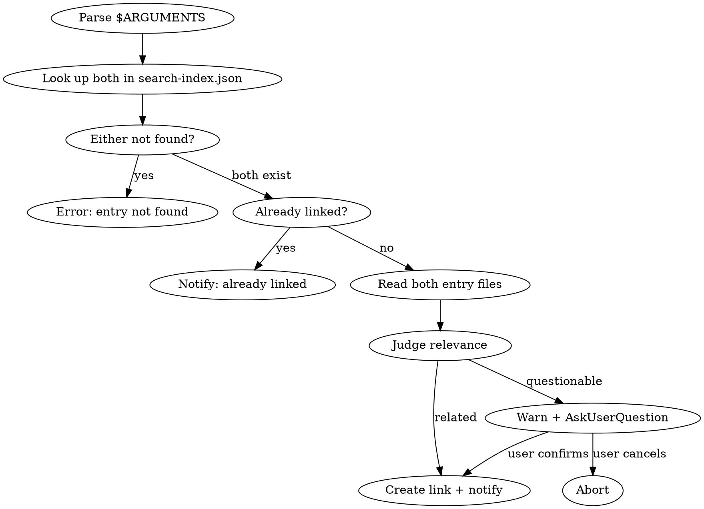

# Knowledge Base - Link Entries

## Overview

Create a bidirectional link between two knowledge entries. Validates that the entries are meaningfully related before linking to prevent accidental noise in the knowledge graph.

## Path Resolution

The knowledge base root (`KB_ROOT`) is:
- Linux/macOS: `$HOME/.claude/knowledge`
- Windows: `$env:USERPROFILE\.claude\knowledge`

## Argument Parsing

- `$ARGUMENTS` must contain exactly two entry IDs separated by space
- Examples: `/kb-link decorators metaprogramming`, `/kb-link cap-theorem consistency-models`
- If fewer than 2 arguments: prompt user for missing entry ID
- If more than 2: warn and use first two

## Workflow



## Steps

### 1. Parse & Validate

Parse two entry IDs from `$ARGUMENTS`. Look up both in `{KB_ROOT}/search-index.json`:
- If either entry ID is not found, output:
  > 未找到条目「{id}」。使用 `/kb-list` 查看所有条目。
- If both not found, list both.

### 2. Check Existing Link

Check if entry A's `related` array in search-index.json already contains B's ID (or vice versa):
- If already linked:
  > 「{A}」和「{B}」已经关联。

### 3. Read Entry Content

Read both entry files using the `path` from search-index.json. Load full content of both entries to understand their topics.

### 4. Judge Relevance

Analyze both entries' content and determine if a meaningful relationship exists. Consider:
- **Conceptual connection**: one concept builds on, explains, or extends the other
- **Practical relationship**: one is the theoretical basis and the other is its application
- **Same domain**: both belong to the same knowledge domain or share significant overlap
- **Prerequisite relationship**: understanding one helps understand the other

**If clearly related** (strong conceptual, practical, or domain overlap):
- Proceed directly to step 5
- Prepare a one-sentence reason explaining the relationship

**If questionable** (weak or unclear connection):
- Use AskUserQuestion to warn the user:
  ```
  question: "「{A}」和「{B}」的关联性不太明显：{reason}。确定要关联吗？"
  options:
    - label: "确认关联"
      description: "建立双向链接"
    - label: "取消"
      description: "不建立关联"
  ```
- If user cancels, abort and output:
  > 已取消关联操作。

### 5. Create Bidirectional Link

Perform all updates atomically:

**a. Update entry A's frontmatter:**
- Read entry A's file
- Add B's ID to the `links` array in frontmatter (create array if missing)
- Write back

**b. Update entry B's frontmatter:**
- Read entry B's file
- Add A's ID to the `links` array in frontmatter (create array if missing)
- Write back

**c. Update search-index.json:**
- Add B's ID to A's `related` array
- Add A's ID to B's `related` array
- Update `last_updated`
- Write back

### 6. Output

> 已关联「{A}」↔「{B}」（{one-sentence reason}）

Then remind:
- `/kb-detail {A}` — 查看条目及其关联
- `/kb-detail {B}` — 查看条目及其关联

## Edge Cases

- Self-link (`/kb-link A A`): reject with "不能将条目与自身关联"
- Entry has no `links` in frontmatter: create the field when adding first link
- Partial match on entry IDs: use same fuzzy matching as kb-detail (exact id → partial title → tags)
