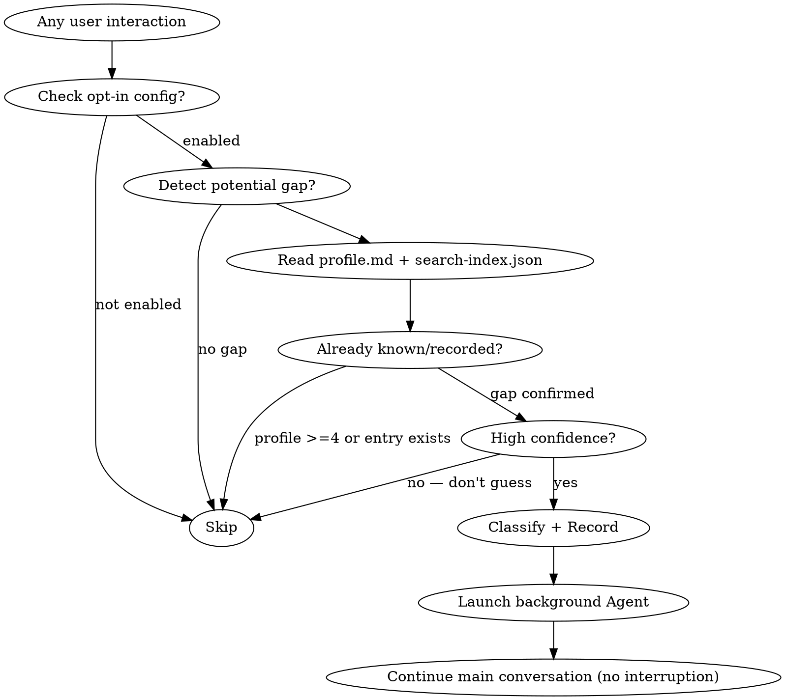

# Knowledge Collector (Opt-In Auto-Detection)

## Overview

Monitor interactions for knowledge gaps and automatically collect them into the knowledge base. This skill operates in every scenario — coding, Q&A, theoretical discussions, debugging, architecture talks, learning sessions, etc.

**Key principle: detect → record → explain in background → never interrupt the main flow.**

## Activation Requirement

**This skill is OFF by default.** It only activates when the user has explicitly configured it.

Check for activation: look for `knowledge-collector: true` in the user's CLAUDE.md (project or global). If not present, this skill does NOT run — skip entirely.

Example CLAUDE.md configuration:
```markdown
# Knowledge Tracker Settings
knowledge-collector: true
```

## Configuration

```yaml
AUTO_NOTIFY_ONLY: true       # high confidence: just notify, don't ask
BACKGROUND_EXPLAIN: true     # launch sub-agent to generate detailed explanation
```

## When to Use (High Confidence Only)

**Only auto-record when signals are strong and unambiguous:**

**In Q&A / Discussion:**
- User asks "X是什么" / "什么是X" / "X是为了什么" about a concept
- User asks for explanation of a term, principle, or mechanism
- User explicitly requests to understand something ("给我讲解一下X")

**In Coding:**
- User asks "这行什么意思" / "这个函数做什么"
- User makes errors indicating fundamental misunderstanding

**In Debugging:**
- User asks about error messages or concepts within errors
- User doesn't understand why something fails

**Universal:**
- User says "我不太懂", "没听过", "第一次见", "记一下"
- Topic is rated < 4 in user's profile AND user is clearly learning it (not just mentioning it)

## When NOT to Use

- User is clearly testing/reviewing code they already understand
- Trivial questions that don't represent a knowledge gap (e.g., "这个文件在哪")
- User explicitly says they don't want to record
- User explicitly invokes `/learn` — handled by the `learn` skill
- Topic already exists in knowledge base at same or higher level (check search-index.json)
- Topic is rated ★★★★+ in profile.md (user already knows it well)

## Core Workflow



## Execution Flow (Non-Blocking)

**CRITICAL: The main conversation must NOT be interrupted.** Follow this order:

1. **Detect** the knowledge gap from user's message
2. **Check** profile.md and search-index.json (quick read, inline)
3. **Classify** as 技 or 道
4. **Output one notification line** (appended naturally to your main response):
   > 📝 已记录「{topic}」到知识库 [{技|道}/{category}]
5. **Continue answering the user's actual question** as normal
6. **After your main response is complete**, launch a background Agent to generate the entry

The notification line should be placed at the END of your response, after you've fully answered the user's question. It should feel like a footnote, not an interruption.

## Classification Rules

**"技" (Technique/Skill)** — practical knowledge with direct application:
- Framework APIs, library usage patterns
- CLI tools, commands, configuration
- Coding patterns, idioms
- DevOps practices, deployment techniques

**"道" (Principle/Theory)** — conceptual knowledge requiring deeper understanding:
- Design patterns, architectural principles
- Algorithms, data structures theory
- Distributed systems concepts
- Mathematical/theoretical foundations

## Background Agent Task

After outputting your main response + notification, launch a background Agent (`run_in_background: true`) with a self-contained prompt to:

1. Create the entry file at `{KB_ROOT}/{技|道}/{category}/{topic-slug}.md`
2. Update `INDEX.md`
3. Update `search-index.json`
4. Optionally update `profile.md`
5. Send PushNotification when done

### Path Resolution

The knowledge base root (`KB_ROOT`) is:
- Linux/macOS: `$HOME/.claude/knowledge`
- Windows: `$env:USERPROFILE\.claude\knowledge`

Detect the platform and use the appropriate path. In the Agent prompt, provide the resolved absolute path directly.

### Agent Prompt Template

```
你是知识库内容生成助手。请完成以下任务：

## 任务信息
- 知识点名称: {Topic Name}
- 类型: {技|道}
- 分类: {category}
- 文件ID (slug): {topic-slug}
- 知识库根目录: {resolved KB_ROOT absolute path}
- 条目文件路径: {KB_ROOT}/{技|道}/{category}/{topic-slug}.md
- 用户画像路径: {KB_ROOT}/profile.md
- 用户背景摘要: {从profile中提取的相关信息}

## 步骤

### 1. 创建目录（如需要）
确保 `{KB_ROOT}/{技|道}/{category}/` 目录存在。

### 2. 生成条目文件
{根据类型插入对应模板 — 见下方}

### 3. 更新 INDEX.md
读取 `{KB_ROOT}/INDEX.md`，在对应章节下添加条目链接，更新统计数字。

### 4. 更新 search-index.json
读取 `{KB_ROOT}/search-index.json`，追加条目，更新 last_updated。

### 5. 发送通知
使用 PushNotification 通知用户：「{Topic Name}」知识条目已生成完成
```

### Entry Templates

**For "技" entries:**

```markdown
---
type: 技
category: {category}
created: {YYYY-MM-DD}
level: brief
status: new
source-project: {current project name if relevant}
---
# {Topic Name}

## 是什么（一句话）
{concise definition}

## 使用场景
- {scenario 1}
- {scenario 2}

## 基本用法
{code example showing primary usage}

## 常见陷阱
- {pitfall 1}
- {pitfall 2}
```

**For "道" entries:**

```markdown
---
type: 道
category: {category}
created: {YYYY-MM-DD}
level: brief
status: new
source-project: {current project name if relevant}
---
# {Topic Name}

## 概念说明
{2-3 sentence explanation, tailored to user's level}

## 相关领域
- {related domain 1}
- {related domain 2}

## 前置知识
- {prerequisite 1}
- {prerequisite 2}

## 深入方向
{brief pointer to what deeper study looks like}
```

### Search Index Entry Format

```json
{
  "id": "{topic-slug}",
  "type": "{技|道}",
  "category": "{category}",
  "title": "{Topic Name}",
  "tags": ["{tag1}", "{tag2}", ...],
  "related": ["{related-id-1}", ...],
  "profile_domains": ["{domain1}", ...],
  "level": "brief",
  "status": "new",
  "path": "{技|道}/{category}/{topic-slug}.md",
  "created": "{YYYY-MM-DD}",
  "summary": "{one-line summary}"
}
```

## Deduplication Rules

Before recording, check:
1. `search-index.json` — does an entry with same `id` or very similar `title` exist?
2. If yes and level is "brief" → skip (user can `/kb-deep` it later)
3. If yes and the new context adds significant new angle → update existing entry instead

## Rate Limiting

- Don't record more than 3 topics per conversation turn
- If multiple gaps detected in one message, pick the most significant one (lowest profile rating, most central to user's question)
- Don't record sub-concepts if the parent concept is being recorded (e.g., don't record "softmax" separately if recording "Self-Attention计算流程")

## Important

- **NEVER interrupt the main conversation flow** — answer first, notify at the end
- Always check profile.md before deciding to record
- Keep entries concise (brief level) — user can `/kb-deep` later
- Use Chinese for all entry content
- The background Agent prompt must be fully self-contained
- If the background Agent fails (permissions etc.), it's acceptable — the notification was already shown, user can `/learn` manually
