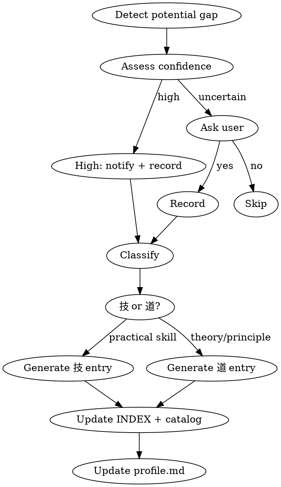

# Knowledge Collector

## Overview

Identify knowledge gaps during vibe coding sessions and collect them into a persistent, categorized knowledge base. Operates in two modes: auto-detection during coding and manual `/learn` marking.

## Configuration

```yaml
# Control variables - adjust behavior
AUTO_NOTIFY_ONLY: true       # true = high confidence: just notify, don't ask
ASK_ON_UNCERTAIN: true       # true = uncertain cases: ask user before recording
```

When `AUTO_NOTIFY_ONLY` is true and confidence is high, simply output one line:
> "已记录「{topic}」到知识库 [{技|道}/{category}]"

When `ASK_ON_UNCERTAIN` is true and confidence is uncertain, ask:
> "你对「{topic}」了解吗？需要我记录到知识库吗？"

## When to Use

- During coding when the user asks questions revealing unfamiliarity with a concept
- When the user's code shows patterns suggesting they're unfamiliar with a framework/library feature
- When the user says "这个是什么", "我不太懂", "记一下这个"
- When manually invoked as `/learn <topic>`

## When NOT to Use

- User is clearly testing or reviewing code they already understand
- Trivial syntax questions that don't represent a knowledge gap
- User explicitly says they don't want to record

## Core Workflow



## Classification Rules

**"技" (Technique/Skill)** — practical knowledge with direct application:
- Framework APIs, library usage patterns
- CLI tools, commands, configuration
- Coding patterns, idioms
- DevOps practices, deployment techniques

**"道" (Principle/Theory)** — conceptual knowledge requiring deeper understanding:
- Design patterns, architectural principles
- Algorithms, data structures theory
- Distributed systems concepts
- Mathematical/theoretical foundations

## Entry Generation

When generating an entry, also prepare the following index fields for search-index.json:
- **id**: the topic-slug (filename without .md)
- **tags**: 3-5 keyword tags relevant to the topic, used for search
- **related**: IDs of related existing entries (check search-index.json for candidates)
- **profile_domains**: which domain(s) in profile.md this entry maps to
- **summary**: the "是什么（一句话）" or "概念说明" first sentence

### For "技" entries

Create file at `~/.claude/knowledge/技/{category}/{topic-slug}.md`:

```markdown
---
type: 技
category: {category}
created: {YYYY-MM-DD}
level: brief
status: new
source-project: {current project name if relevant}
---
# {Topic Name}

## 是什么（一句话）
{concise definition}

## 使用场景
- {scenario 1}
- {scenario 2}

## 基本用法
{code example showing primary usage}

## 常见陷阱
- {pitfall 1}
- {pitfall 2}
```

### For "道" entries

Create file at `~/.claude/knowledge/道/{category}/{topic-slug}.md`:

```markdown
---
type: 道
category: {category}
created: {YYYY-MM-DD}
level: brief
status: new
source-project: {current project name if relevant}
---
# {Topic Name}

## 概念说明
{2-3 sentence explanation}

## 相关领域
- {related domain 1}
- {related domain 2}

## 前置知识
- {prerequisite 1}
- {prerequisite 2}

## 深入方向
{brief pointer to what deeper study looks like}
```

## File Updates After Recording

1. **Update category catalog** `~/.claude/knowledge/{技|道}/{category}/_catalog.md`:
   - Add entry to the list with one-line description

2. **Update INDEX.md** `~/.claude/knowledge/INDEX.md`:
   - Add entry under appropriate category section

3. **Update profile.md** `~/.claude/knowledge/profile.md`:
   - Adjust knowledge level assessment for the relevant domain
   - Add to "待学习" section if new domain

4. **Update search-index.json** `~/.claude/knowledge/search-index.json`:
   - Read the current JSON file
   - Append a new entry object to the `entries` array:
     ```json
     {
       "id": "{topic-slug}",
       "type": "{技|道}",
       "category": "{category}",
       "title": "{Topic Name}",
       "tags": ["{tag1}", "{tag2}", ...],
       "related": ["{related-id-1}", ...],
       "profile_domains": ["{domain1}", ...],
       "level": "brief",
       "status": "new",
       "path": "{技|道}/{category}/{topic-slug}.md",
       "created": "{YYYY-MM-DD}",
       "summary": "{one-line summary}"
     }
     ```
   - Update `last_updated` to current date
   - Write the updated JSON back

## Manual Invocation

When invoked as `/learn`:
- `$ARGUMENTS` contains the topic name or description
- Classify immediately and generate entry
- If topic is ambiguous, ask user to clarify: 技 or 道?

## Auto-Detection Signals

High confidence signals (notify only):
- User explicitly asks "这是什么？" about a concept
- User copies code without understanding (asks "这行什么意思")
- User makes errors that indicate fundamental misunderstanding of a framework

Uncertain signals (ask first):
- User writes working but non-idiomatic code
- User asks about best practices (may already know basics)
- Topic is adjacent to user's known expertise (check profile.md)

## Important

- Always read `~/.claude/knowledge/profile.md` before assessing gaps
- Never record knowledge the user clearly already knows (check profile)
- Keep entries concise at initial creation — user can request `/kb-deep` later
- Use Chinese for all entry content by default
