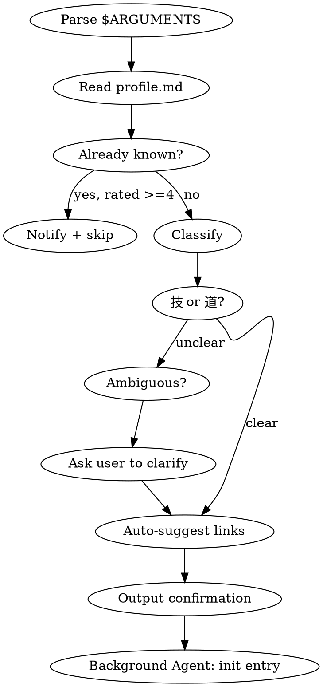

# Learn - Manual Knowledge Point Collection

## Overview

Manually add a knowledge point to the knowledge base. This is the user-facing command for explicitly marking topics they want to learn or record.

## Workflow



## Argument Parsing

- `$ARGUMENTS` contains the topic name or description
- Examples: `/learn FastAPI依赖注入`, `/learn CAP定理`, `/learn Python装饰器`
- If no argument provided, ask user: "请输入你想记录的知识点主题"

## Steps (Synchronous — main flow)

1. **Parse topic** from `$ARGUMENTS`
2. **Read profile** at `{KB_ROOT}/profile.md` to check existing knowledge level
3. **Check duplicates** in `{KB_ROOT}/search-index.json` — if an entry with matching `id` or similar `title` already exists, notify and ask if user wants to update it instead
4. **Classify** as "技" (practical skill) or "道" (principle/theory):
   - If clearly practical (framework API, tool usage, coding pattern) → 技
   - If clearly theoretical (design pattern, algorithm theory, architecture principle) → 道
   - If ambiguous → ask user via AskUserQuestion: "「{topic}」属于哪个类别？" with options "技（实践技能）" and "道（原理理论）"
5. **Auto-suggest links** — scan search-index.json for related existing entries:
   - Find entries with overlapping `category`, `tags`, or keyword similarity to the new topic
   - If 1-3 candidates found, use AskUserQuestion (multiSelect: true):
     "以下已有条目可能与「{topic}」相关，是否建立关联？"
     Options: top 2-3 candidates, each showing `{id} [{type}] — {summary}`
   - If no candidates or user selects none: `links` will be empty
   - Store user-confirmed entry IDs as the `links` list
6. **Output confirmation** immediately (see Output section)
7. **Launch background Agent** to generate entry content and update all files (see Background Entry Initialization section)

## Classification Rules

**"技" (Technique/Skill)** — practical knowledge with direct application:
- Framework APIs, library usage patterns
- CLI tools, commands, configuration
- Coding patterns, idioms
- DevOps practices, deployment techniques

**"道" (Principle/Theory)** — conceptual knowledge requiring deeper understanding:
- Design patterns, architectural principles
- Algorithms, data structures theory
- Distributed systems concepts
- Mathematical/theoretical foundations

## Output

After classification and link suggestion are determined, **immediately** output (do NOT wait for the background Agent):
> 已记录「{topic}」到知识库 [{category}]（{技|道}），正在后台生成内容...

If links were confirmed, also show:
> 🔗 关联: {linked-entry-1}, {linked-entry-2}

Then remind available follow-up commands:
- `/kb-detail {entry}` — 查看条目内容
- `/kb-simplify {entry} [方向]` — 精简讲解
- `/kb-deep {entry} [方向]` — 深入讲解

## Background Entry Initialization

After outputting the confirmation, launch a background Agent to generate the entry and update all index files. Use the `Agent` tool with `run_in_background: true`.

### Path Resolution

The knowledge base root (`KB_ROOT`) is:
- Linux/macOS: `$HOME/.claude/knowledge`
- Windows: `$env:USERPROFILE\.claude\knowledge`

Detect the platform and use the appropriate path. In the Agent prompt, provide the resolved absolute path directly.

### Agent Prompt Construction

Build the prompt by filling in the following template with the values determined during the synchronous steps:

```
你是知识库内容生成助手。请完成以下任务：

## 任务信息
- 知识点名称: {Topic Name}
- 类型: {技|道}
- 分类: {category}
- 文件ID (slug): {topic-slug}
- 知识库根目录: {resolved KB_ROOT absolute path}
- 条目文件路径: {KB_ROOT}/{category}/{topic-slug}.md
- 用户画像路径: {KB_ROOT}/profile.md
- 关联条目: {confirmed-link-ids, 逗号分隔, 如无则为"无"}

## 步骤

### 1. 读取用户画像
读取 `{KB_ROOT}/profile.md`，了解用户背景和现有知识水平，以便生成贴合用户水平的内容。

### 2. 创建目录（如需要）
确保 `{KB_ROOT}/{category}/` 目录存在。

### 3. 生成条目文件
根据类型生成条目内容并写入文件。

{INSERT_TEMPLATE_FOR_TYPE — see "Entry Templates" below}

### 4. 更新 INDEX.md
读取 `{KB_ROOT}/INDEX.md`，在对应的 category 章节下添加条目链接（如该 category 章节不存在则新建）。更新底部统计数字。

### 5. 更新 search-index.json
读取 `{KB_ROOT}/search-index.json`，向 entries 数组追加：
{INSERT_SEARCH_INDEX_ENTRY — see "Search Index Entry" below}
更新 `last_updated` 为当前日期。

### 6. 更新关联条目（如有关联）
如果有关联条目，对每个关联条目执行：
- 读取关联条目的 .md 文件，在 frontmatter 的 `links` 数组中添加本条目的 ID
- 在 search-index.json 中，找到关联条目的 entry，在其 `related` 数组中添加本条目的 ID

### 7. 更新 profile.md
读取 `{KB_ROOT}/profile.md`，在相关领域调整评级或在「待学习」区域添加新条目。

### 8. 发送通知
使用 PushNotification 工具通知用户：「{Topic Name}」知识条目已生成完成
```

### Entry Templates

**For "技" entries** — include this in the Agent prompt:

```
按以下模板生成「技」类型条目文件：

---
type: 技
category: {category}
created: {YYYY-MM-DD}
level: brief
status: new
links: [{confirmed-link-ids}]
source-project: {current project name if relevant}
---
# {Topic Name}

## 是什么（一句话）
{concise definition}

## 使用场景
- {scenario 1}
- {scenario 2}

## 基本用法
{code example showing primary usage}

## 常见陷阱
- {pitfall 1}
- {pitfall 2}
```

**For "道" entries** — include this in the Agent prompt:

```
按以下模板生成「道」类型条目文件：

---
type: 道
category: {category}
created: {YYYY-MM-DD}
level: brief
status: new
links: [{confirmed-link-ids}]
source-project: {current project name if relevant}
---
# {Topic Name}

## 概念说明
{2-3 sentence explanation}

## 相关领域
- {related domain 1}
- {related domain 2}

## 前置知识
- {prerequisite 1}
- {prerequisite 2}

## 深入方向
{brief pointer to what deeper study looks like}
```

### Search Index Entry

Include this in the Agent prompt for the search-index.json update:

```json
{
  "id": "{topic-slug}",
  "type": "{技|道}",
  "category": "{category}",
  "title": "{Topic Name}",
  "tags": ["{tag1}", "{tag2}", ...],
  "related": ["{confirmed-link-ids}", ...],
  "profile_domains": ["{domain1}", ...],
  "level": "brief",
  "status": "new",
  "path": "{category}/{topic-slug}.md",
  "created": "{YYYY-MM-DD}",
  "summary": "{one-line summary}"
}
```

Tags, profile_domains, and summary should be determined by the Agent based on the generated content and existing search-index.json entries. The `related` field should include the confirmed link IDs from step 5.

## Important

- Always read `{KB_ROOT}/profile.md` before recording
- Check for duplicate entries in search-index.json before creating
- Keep entries concise at initial creation — user can request `/kb-deep` later
- Use Chinese for all entry content by default
- The synchronous flow must complete BEFORE the Agent starts — the Agent needs the classification and link results
- The Agent prompt must be **self-contained** — include all templates, paths, and rules directly in the prompt since the Agent cannot access this skill file
