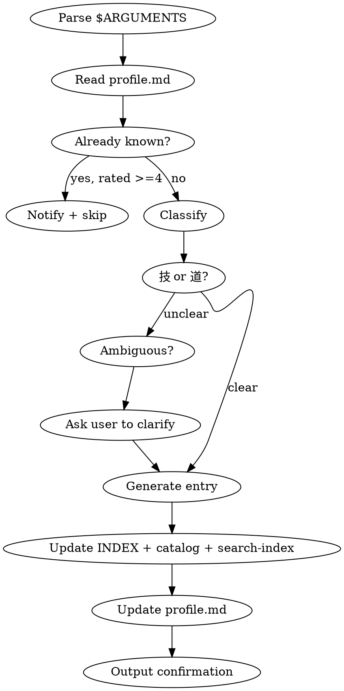

# Learn - Manual Knowledge Point Collection

## Overview

Manually add a knowledge point to the knowledge base. This is the user-facing command for explicitly marking topics they want to learn or record.

## Workflow



## Argument Parsing

- `$ARGUMENTS` contains the topic name or description
- Examples: `/learn FastAPI依赖注入`, `/learn CAP定理`, `/learn Python装饰器`
- If no argument provided, ask user: "请输入你想记录的知识点主题"

## Steps

1. **Parse topic** from `$ARGUMENTS`
2. **Read profile** at `~/.claude/knowledge/profile.md` to check existing knowledge level
3. **Check duplicates** in `~/.claude/knowledge/search-index.json` — if an entry with matching `id` or similar `title` already exists, notify and ask if user wants to update it instead
4. **Classify** as "技" (practical skill) or "道" (principle/theory):
   - If clearly practical (framework API, tool usage, coding pattern) → 技
   - If clearly theoretical (design pattern, algorithm theory, architecture principle) → 道
   - If ambiguous → ask user via AskUserQuestion: "「{topic}」属于哪个类别？" with options "技（实践技能）" and "道（原理理论）"
5. **Generate entry** file and update all indexes (same as knowledge-collector's entry generation)
6. **Output confirmation**

## Classification Rules

**"技" (Technique/Skill)** — practical knowledge with direct application:
- Framework APIs, library usage patterns
- CLI tools, commands, configuration
- Coding patterns, idioms
- DevOps practices, deployment techniques

**"道" (Principle/Theory)** — conceptual knowledge requiring deeper understanding:
- Design patterns, architectural principles
- Algorithms, data structures theory
- Distributed systems concepts
- Mathematical/theoretical foundations

## Entry Generation

When generating an entry, also prepare the following index fields for search-index.json:
- **id**: the topic-slug (filename without .md)
- **tags**: 3-5 keyword tags relevant to the topic, used for search
- **related**: IDs of related existing entries (check search-index.json for candidates)
- **profile_domains**: which domain(s) in profile.md this entry maps to
- **summary**: the "是什么（一句话）" or "概念说明" first sentence

### For "技" entries

Create file at `~/.claude/knowledge/技/{category}/{topic-slug}.md`:

```markdown
---
type: 技
category: {category}
created: {YYYY-MM-DD}
level: brief
status: new
source-project: {current project name if relevant}
---
# {Topic Name}

## 是什么（一句话）
{concise definition}

## 使用场景
- {scenario 1}
- {scenario 2}

## 基本用法
{code example showing primary usage}

## 常见陷阱
- {pitfall 1}
- {pitfall 2}
```

### For "道" entries

Create file at `~/.claude/knowledge/道/{category}/{topic-slug}.md`:

```markdown
---
type: 道
category: {category}
created: {YYYY-MM-DD}
level: brief
status: new
source-project: {current project name if relevant}
---
# {Topic Name}

## 概念说明
{2-3 sentence explanation}

## 相关领域
- {related domain 1}
- {related domain 2}

## 前置知识
- {prerequisite 1}
- {prerequisite 2}

## 深入方向
{brief pointer to what deeper study looks like}
```

## File Updates After Recording

1. **Update category catalog** `~/.claude/knowledge/{技|道}/{category}/_catalog.md`:
   - Add entry to the list with one-line description

2. **Update INDEX.md** `~/.claude/knowledge/INDEX.md`:
   - Add entry under appropriate category section

3. **Update profile.md** `~/.claude/knowledge/profile.md`:
   - Adjust knowledge level assessment for the relevant domain
   - Add to "待学习" section if new domain

4. **Update search-index.json** `~/.claude/knowledge/search-index.json`:
   - Read the current JSON file
   - Append a new entry object to the `entries` array:
     ```json
     {
       "id": "{topic-slug}",
       "type": "{技|道}",
       "category": "{category}",
       "title": "{Topic Name}",
       "tags": ["{tag1}", "{tag2}", ...],
       "related": ["{related-id-1}", ...],
       "profile_domains": ["{domain1}", ...],
       "level": "brief",
       "status": "new",
       "path": "{技|道}/{category}/{topic-slug}.md",
       "created": "{YYYY-MM-DD}",
       "summary": "{one-line summary}"
     }
     ```
   - Update `last_updated` to current date
   - Write the updated JSON back

## Output

After successful recording:
> 已记录「{topic}」到知识库 [{技|道}/{category}]

Then remind available follow-up commands:
- `/kb-detail {entry}` — 查看条目内容
- `/kb-simplify {entry} [方向]` — 精简讲解
- `/kb-deep {entry} [方向]` — 深入讲解

## Important

- Always read `~/.claude/knowledge/profile.md` before recording
- Check for duplicate entries in search-index.json before creating
- Keep entries concise at initial creation — user can request `/kb-deep` later
- Use Chinese for all entry content by default
